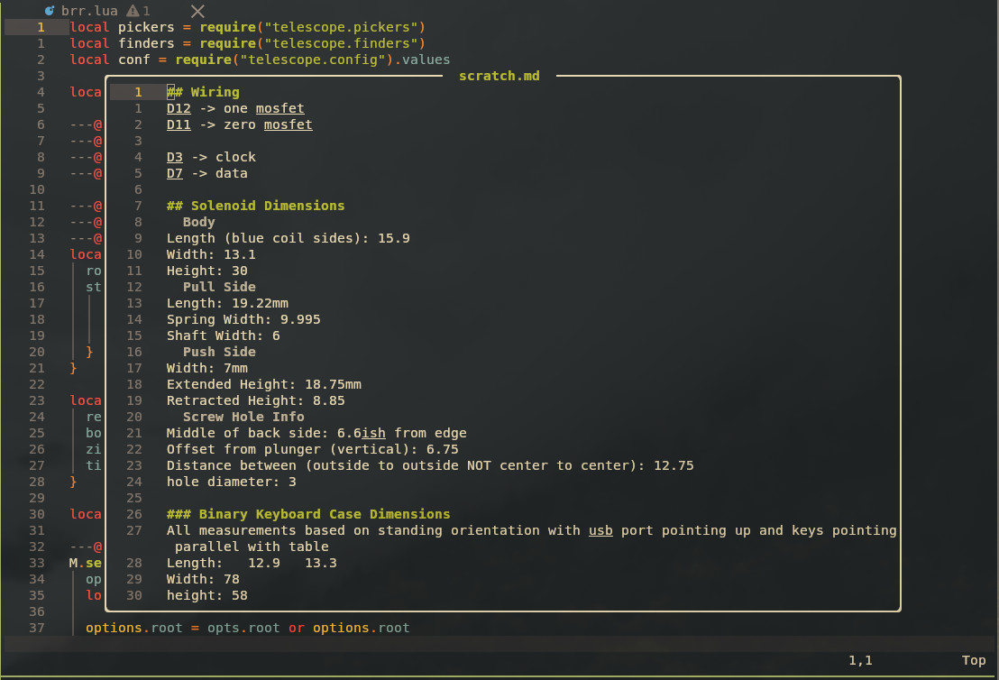

## brr.nvim
This is a scratch file project based off of Folke's in the wonderful [snacks.nvim](https://github.com/folke/snacks.nvim) plugin. That one was more directory / git based. I just wanted a simple global scratch folder for daily notes, persistent todos, temporary link storage, etc. This was also a great excuse to write my first ( very simple ) nvim plugin.

I plan to make a companion plugin that will allow you to run code in markdown codeblocks like TJ Devries has done in his [present.nvim](https://github.com/tjdevries/present.nvim) plugin. 


At the moment this is pretty bare bones and may stay that way. It does what I need it to but I will add functionality if I think of a helpful addition. 

The name is brr.nvim just because I can't remember anything and "brrrr" is the sound I hear while trying to remember what I was doing 3 seconds ago. I also suck at names.


## Dependencies
* Telescope -- For the list command

## Setup - Lazy
```lua
return { "leobeosab/brr.nvim", 
    opts = {
        root = "~/.scratch_notes", -- Root where all scratch files are stored, I throw mine in an Obsidian vault
        style = {
            width = 0.8, -- 0-1, 1 being full width, 0 being, well, 0
            height = 0.8, -- 0-1
            title_padding = 2 -- number of spaces as padding in the top border title 
        }
    },
    keys = { -- You'll probably want to change my weird keybinds, these are just examples
        { "<leader>.", "<cmd>Scratch scratch.md<cr>", desc = "Open persistent scratch" },
        { "<leader>sd", "<cmd>Scratch<cr>", desc = "Open daily scratch" },
        { "<leader>sf", "<cmd>ScratchList<cr>", desc = "Find scratch" }
    }
}
```

## Usage
I've added the `Scratch` and `ScratchList` commands. 

### Scratch
Usage
```
:Scratch filename.md -- Opens an existing or new file in a scratch window
:Scratch -- Opens a 'daily' scratch with the current date
```

### Scratch List
```
:ScratchList -- Opens a telescope finder in the root scratch directory
```

## Screenshot(s)


## Things you should use instead
* [snacks.nvim](https://github.com/folke/snacks.nvim)

## Special thanks
* [Folke](https://github.com/folke) makes a ton of awesome plugins
* [TJDevries](https://github.com/tjdevries) makes great plugins and videos about neovim
